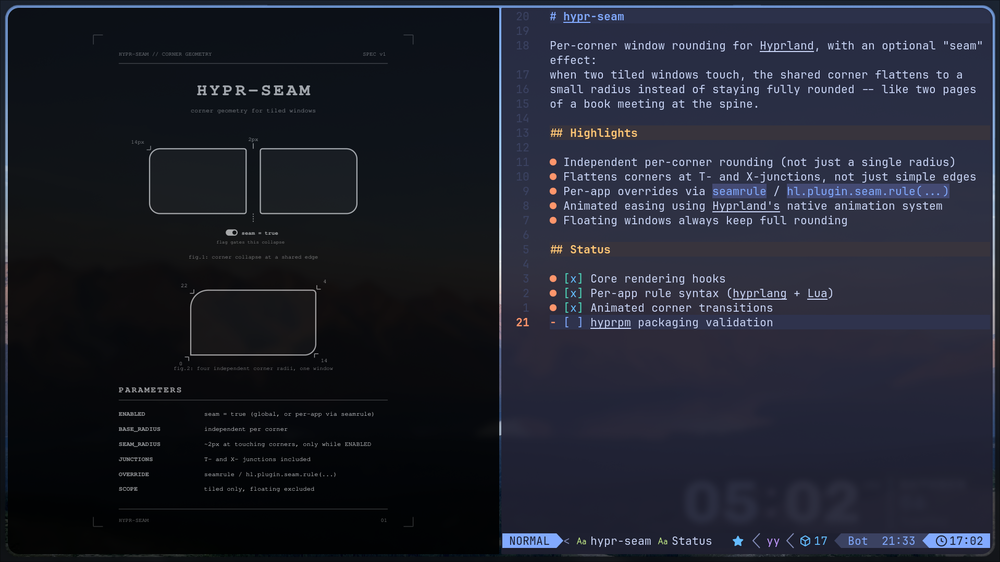

# hypr-seam

A Hyprland plugin for independent per-corner rounding, plus an optional
seam effect: the corner where two tiled windows touch flattens out instead
of staying round, so your layout reads as one continuous shape instead of
a grid of separate rounded boxes. T-junctions and X-junctions, where three
or four windows meet at a point, flatten the same way across every window
involved. Both base rounding and the seam effect can be set per app, so
your terminal can stay sharp-cornered while everything else gets rounded.

## Demo



## Requirements

- Hyprland, built and tested against the 0.56.2 internal ABI. The plugin
  hooks an internal, version-unstable function (`createFunctionHook`, also
  used by plugins like `hy3`), so a Hyprland update that changes that
  function's signature needs a matching plugin update, not just a rebuild.
- `decoration:rounding = 0` set globally. This plugin fully replaces
  native corner rendering; leaving it on conflicts with the plugin's own
  rounding.

## Installation

### Via hyprpm

The repo ships an `hyprpm.toml` manifest, so it can be added directly:

```sh
hyprpm add https://github.com/misaid/hypr-seam
hyprpm enable hypr-seam
```

`hyprpm` builds the plugin using the manifest's build script (`make all`,
then the resulting `build/libhypr-seam.so` is copied to `hypr-seam.so`).

### Manual build

The repo also has a plain `Makefile` wrapping a `meson`/`ninja` build, for
building outside of `hyprpm`:

```sh
git clone https://github.com/misaid/hypr-seam
cd hypr-seam
make all
```

This produces `build/libhypr-seam.so`. Load it for the running Hyprland
session with:

```sh
hyprctl plugin load "$(pwd)/build/libhypr-seam.so"
```

or add the same path to your Hyprland config's `plugin =` line to load it
on every start.

## Configuration

### Global options

All values live under the `plugin:seam:` prefix.

| Key | Type | Default | Meaning |
|---|---|---|---|
| `plugin:seam:rounding` | int | `22` | Uniform base radius used for any corner without its own `rounding_*` override. |
| `plugin:seam:rounding_topleft` | int | = `rounding` | Base top-left corner radius. |
| `plugin:seam:rounding_topright` | int | = `rounding` | Base top-right corner radius. |
| `plugin:seam:rounding_bottomleft` | int | = `rounding` | Base bottom-left corner radius. |
| `plugin:seam:rounding_bottomright` | int | = `rounding` | Base bottom-right corner radius. |
| `plugin:seam:rounding_power` | float | `2.0` | Squircle exponent for the corner curve, matching Hyprland's native default look. |
| `plugin:seam:enabled` | bool | `false` | Global master switch for the seam effect. |
| `plugin:seam:seam_radius` | int | `2` | Radius a corner collapses to once it's flagged as touching a neighboring tiled window. |
| `plugin:seam:tolerance` | int (px) | `-1` | Max gap between two window edges still counted as touching. `-1` (default) derives it from `general:gaps_in`; set a number to override. |
| `plugin:seam:animate` | bool | `true` | Eases a corner's radius between its base and seam values instead of snapping. |
| `plugin:seam:animation_speed` | float (ms) | `300` | Duration of that easing transition. |
| `plugin:seam:animation_curve` | string | `"default"` | Name of a bezier curve already registered via Hyprland's `bezier =` (or `hl.curve(...)`). |
| `plugin:seam:force_round_risky_surfaces` | bool | `false` | Also round a window's subsurfaces where they reach the window's own corners. Turn this on if Firefox-based browsers (Firefox, Zen, ...) keep square corners. See below. |
| `plugin:seam:round_borders` | bool | `false` | Round the native border to match the window's live corner radii, seam flattening included. Needs `general:border_size > 0`. |
| `plugin:seam:round_shadows` | bool | `false` | Round the native drop shadow to match the window's live corner radii, seam flattening included. Needs `decoration:shadow:enabled = true`. |

Base corner radii resolve per window: a matching `seamrule rounding`
override, or else the four global `rounding_*` values. The seam flag
resolves the same way, via `seamrule seam` or else `plugin:seam:enabled`.
Floating windows always skip seam resolution and render with base
rounding only.

### Example

A plain hyprlang `.conf` snippet covering the common options:

```
plugin:seam:enabled = true
plugin:seam:rounding = 12
plugin:seam:seam_radius = 2
plugin:seam:animate = true
plugin:seam:animation_speed = 300

seamrule = rounding 4 4 22 22, class:^(kitty)$
seamrule = seam 0, class:^(foot)$
```

A fuller version of this file, with every option set to its default and
commented, lives at [`examples/seam.conf`](examples/seam.conf); the Lua
DSL equivalent is at [`examples/seam.lua`](examples/seam.lua).

### Per-app rules (`seamrule`)

Hyprland's plugin API has no hook into `windowrulev2`, so `hypr-seam`
parses its own keyword, `seamrule`, using the same `class:`/`title:` match
syntax. For a plain hyprlang `.conf` config:

```
seamrule = rounding <tl> <tr> <bl> <br>, <match>
seamrule = seam <0|1>, <match>
```

Examples:

```
seamrule = rounding 4 4 22 22, class:^(kitty)$      # sharp top corners, rounded bottom
seamrule = rounding 0 0 0 0, class:^(discord)$      # fully square, regardless of global rounding
seamrule = rounding 16 16 16 16, class:^(obsidian)$ # its own uniform radius, independent of the global one
seamrule = seam 1, class:^(mpv)$                    # always flattens, even if plugin:seam:enabled = false
seamrule = seam 0, class:^(foot)$                   # opt out even if plugin:seam:enabled = true
seamrule = seam 0, title:^Picture-in-Picture$       # match by title instead of class
```

`rounding` rules and `seam` rules are independent, so an app can get both:
two `seamrule` lines for the same `class:`/`title:` match, one `rounding`
and one `seam`, apply together. Later rules win on conflict, same as
`windowrulev2`.

For Hyprland's Lua config DSL, use `hl.plugin.seam.rule(...)` instead,
which takes either a `seamrule` string or a table:

```lua
hl.plugin.seam.rule("seam 0, class:^(foot)$")
hl.plugin.seam.rule({ class = "^(kitty)$", rounding = { 4, 4, 22, 22 } })
hl.plugin.seam.rule({ title = "^Picture-in-Picture$", seam = false })
```

A malformed rule, in either form, shows up as a config error with a
file/line reference, the same way Hyprland reports its own config
mistakes.

## Scope and limitations

- hypr-seam only rounds a window's main surface by default, not its
  subsurfaces. GPU-accelerated apps like Firefox-based browsers (Firefox,
  Zen, and others) draw into a subsurface that covers the main surface
  exactly, so the rounding is there but hidden and the window looks
  square. Set `plugin:seam:force_round_risky_surfaces = true` to also
  round subsurfaces where they reach a window's corners; a subsurface
  that doesn't reach a corner, like an embedded video, is never touched.
  This is off by default since it changes how other apps draw their
  subsurfaces, and it has only been tested against Firefox. During a
  resize animation the subsurface can briefly lag the window box, showing
  square corners for a few frames.
- Border and shadow rounding (`plugin:seam:round_borders`,
  `plugin:seam:round_shadows`) are off by default. They use the same
  per-corner re-render technique as window content, applied to Hyprland's
  own border and shadow passes. Until enabled, a window's border and
  shadow stay native (square, if `decoration:rounding = 0`).
