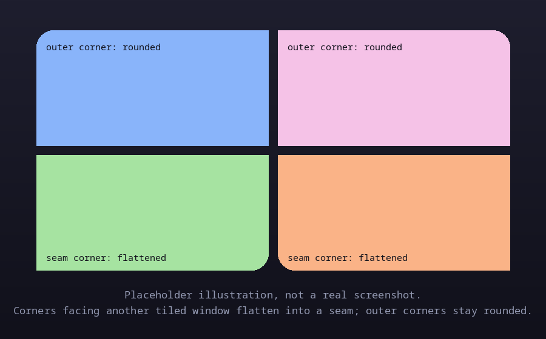

# hypr-seam

A Hyprland plugin that replaces native window-corner rounding with
independent, per-corner rounding, and adds an optional `seam` effect: when
two tiled windows meet edge to edge, the corner where they touch flattens
to a small radius instead of staying fully round. The windows start to look
like two facing pages of an open book, rounded on the outside, meeting at a
flat spine down the middle, rather than a single rounded-off grid line. The
effect also handles T-junctions and X-junctions, where three or four
windows meet at one point, flattening that shared corner on every window
involved. Floating windows are untouched by any of this: they keep ordinary
rounding and never participate in seam detection, either as the window
being flattened or as a neighbor that causes another window to flatten.

## Demo


<!-- TODO: replace with a real demo screenshot or GIF of the plugin running in Hyprland -->

This is a generated placeholder, not a screenshot of the plugin running. A
real demo screenshot or GIF is still needed.

## Requirements

- Hyprland, currently built and tested against the 0.56.2 internal ABI.
  The plugin hooks an internal, version-unstable Hyprland function
  (`createFunctionHook`, the same facility other community plugins such as
  `hy3` use), so a Hyprland upgrade that changes that function's signature
  will need a matching plugin update, not just a rebuild.
- `decoration:rounding = 0` set globally in your Hyprland config. This
  plugin fully replaces native corner rendering, scissoring out each
  corner before Hyprland's own paint call and redrawing it itself, so
  leaving native rounding on would just double up with (or fight) this
  plugin's own rounding.

## Installation

### Via hyprpm

The repo ships an `hyprpm.toml` manifest, so it can be added directly:

```sh
hyprpm add https://github.com/misaid/hypr-seam
hyprpm enable hypr-seam
```

`hyprpm` builds the plugin using the manifest's build script (`make all`,
then the resulting `build/libhypr-seam.so` is copied to `hypr-seam.so`).

### Manual build

The repo also has a plain `Makefile` wrapping a `meson`/`ninja` build, for
building outside of `hyprpm`:

```sh
git clone https://github.com/misaid/hypr-seam
cd hypr-seam
make all
```

This produces `build/libhypr-seam.so`. Load it for the running Hyprland
session with:

```sh
hyprctl plugin load "$(pwd)/build/libhypr-seam.so"
```

or add the same path to your Hyprland config's `plugin =` line to load it
on every start.

## Configuration

### Global options

All values live under the `plugin:seam:` prefix.

| Key | Type | Default | Meaning |
|---|---|---|---|
| `plugin:seam:rounding` | int | `22` | Uniform base radius used for any corner without its own `rounding_*` override. |
| `plugin:seam:rounding_topleft` | int | = `rounding` | Base top-left corner radius. |
| `plugin:seam:rounding_topright` | int | = `rounding` | Base top-right corner radius. |
| `plugin:seam:rounding_bottomleft` | int | = `rounding` | Base bottom-left corner radius. |
| `plugin:seam:rounding_bottomright` | int | = `rounding` | Base bottom-right corner radius. |
| `plugin:seam:rounding_power` | float | `2.0` | Squircle exponent for the corner curve, matching Hyprland's native default look. |
| `plugin:seam:enabled` | bool | `false` | Global master switch for the seam effect. |
| `plugin:seam:seam_radius` | int | `2` | Radius a corner collapses to once it's flagged as touching a neighboring tiled window. |
| `plugin:seam:tolerance` | int (px) | `6` | Maximum gap between two window edges that still counts as "touching." Covers `gaps_in` plus floating-point/scale slop. |
| `plugin:seam:animate` | bool | `true` | Eases a corner's radius between its base and seam values instead of snapping. |
| `plugin:seam:animation_speed` | float (ms) | `300` | Duration of that easing transition. |
| `plugin:seam:animation_curve` | string | `"default"` | Name of a bezier curve already registered via Hyprland's `bezier =` (or `hl.curve(...)`). |

Base corner radii are resolved per window as: a matching `seamrule rounding`
override if one exists, otherwise the four global `rounding_*` values. The
seam flag resolves the same way: a matching `seamrule seam` override if one
exists, otherwise `plugin:seam:enabled`. Floating windows skip seam
resolution entirely and always render with base rounding only, regardless
of what the seam flag would otherwise resolve to.

### Per-app rules (`seamrule`)

Hyprland's plugin API has no hook into the native `windowrulev2` engine, so
`hypr-seam` parses its own keyword, `seamrule`, using the same
`class:`/`title:` match syntax as `windowrulev2`:

```
seamrule = rounding <tl> <tr> <bl> <br>, <match>
seamrule = seam <0|1>, <match>
```

Examples:

```
seamrule = rounding 4 4 22 22, class:^(kitty)$
seamrule = seam 1, class:^(mpv)$
seamrule = seam 0, class:^(foot)$   # opt out even if plugin:seam:enabled = true
```

## Scope and limitations

- Only the window's own content is re-rounded. Border-pass and shadow-pass
  rounding aren't implemented yet. If you run with borders or shadows
  enabled, expect their corners to stay square-ish or mismatched against
  the content rounding this plugin draws.
- Blur-aware corner compositing isn't implemented yet either. The
  rendering hook already has access to the window's blurred backdrop
  texture at the point it runs, so this is expected to be a small addition
  later, not a redesign, but it isn't there now.
- Adjacency is recomputed on layout-changing events (window open/close/move,
  floating toggle, fullscreen, workspace switch, monitor changes), not
  every frame, so corners can be briefly stale mid-drag until the next
  event fires. This matches how Hyprland's own layout updates behave.
